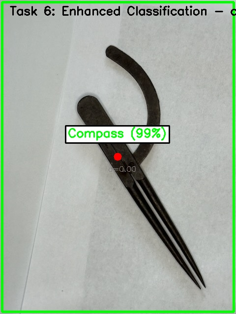
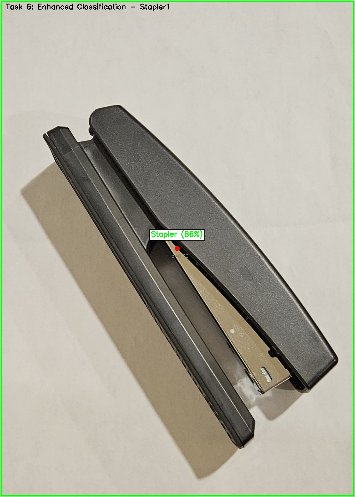

# 2D Object Recognition System


A C++/OpenCV pipeline for real-time 2D object recognition using classical computer vision and ONNX-based deep learning embeddings.


## Features: C++/OpenCV pipeline for real-time 2D object recognition using classical computer vision and ONNX-based deep learning embeddings.


- Custom thresholding, morphological filtering, connected components analysis, and feature extraction

- Real-time camera-based object detection and classification  

- ONNX ResNet18 embedding classifier for robust recognition## FeaturesA C++/OpenCV pipeline for real-time 2D object recognition using classical computer vision and ONNX-based deep learning embeddings.

- Modular pipeline architecture with individual task executables


## Requirements

- Custom thresholding, morphological filtering, connected components analysis, and feature extraction

### Build Tools

- Windows 10/11 (or another OS with C++17 compiler)- Real-time camera-based object detection and classification

- CMake ≥ 3.19

- Visual Studio 2019/2022 or MSVC Build Tools- ONNX ResNet18 embedding classifier for robust recognition## FeaturesA C++/OpenCV pipeline for real-time 2D object recognition using classical computer vision and ONNX-based deep learning embeddings.A C++/OpenCV pipeline for real-time 2D object recognition using classical computer vision and ONNX-based embeddings. The GitHub edition of this project keeps only the source, models, and assets required to build and run the applications.


### Required Downloads- Modular pipeline architecture with individual task executables

Before building, download and place these dependencies:

- Custom thresholding, morphological filtering, connected components analysis, and feature extraction

1. **OpenCV 4.12** - [Download from opencv.org](https://opencv.org/releases/)

   - Extract to `opencv/` folder in project root## Requirements


2. **ONNX Runtime 1.16+** - [Download from GitHub](https://github.com/microsoft/onnxruntime/releases)  - Real-time camera-based object detection and classification

   - Extract to `onnxruntime_nupkg/` folder

### Build Tools

3. **ResNet18 ONNX Model** - [Download resnet18-v2-7.onnx](https://github.com/onnx/models/tree/main/vision/classification/resnet)

   - Place in project root- ONNX ResNet18 embedding classifier for robust recognition


## Quick Start- Windows 10/11 (or another OS with C++17 compiler)


```powershell- CMake ≥ 3.19- Modular pipeline architecture with individual task executables## Features## Features

# From the repository root

.\build_project.bat- Visual Studio 2019/2022 or MSVC Build Tools

# Executables will be placed in bin\Release\

```


Manual CMake build:### Required Downloads

```powershell

mkdir build## Requirements- Custom thresholding, morphological filtering, connected components analysis, and feature extraction- Custom thresholding, morphology, connected components, feature extraction, and enhanced classification stages

cd build

cmake -G "Visual Studio 17 2022" -A x64 ..Before building, download and place these dependencies:

cmake --build . --config Release

```


## Running the Applications1. **OpenCV 4.12** - [Download from opencv.org](https://opencv.org/releases/)


- `bin\Release\realtime_detection.exe` – Real-time camera detection with classification   - Extract to `opencv/` folder in project root### Build Tools- Real-time camera-based object detection and classification- Real-time camera pipeline plus offline tooling for feature inspection

- `bin\Release\camera_selector.exe` – Select and test available cameras  

- `bin\Release\task3.exe` through `task9.exe` – Individual pipeline stage demonstrations


Press **ESC** to exit any application. See on-screen help for task-specific controls.2. **ONNX Runtime 1.16+** - [Download from GitHub](https://github.com/microsoft/onnxruntime/releases)- Windows 10/11 (or another OS with C++17 compiler)


## Project Structure   - Extract to `onnxruntime_nupkg/` folder


```- CMake ≥ 3.19- ONNX ResNet18 embedding classifier for robust recognition- ONNX embedding classifier with pre-trained `resnet18-v2-7.onnx`

Vision2D/

├── src/                          # All source code3. **ResNet18 ONNX Model** - [Download resnet18-v2-7.onnx](https://github.com/onnx/models/tree/main/vision/classification/resnet)

│   ├── custom_threshold.cpp/.h   # Thresholding algorithms

│   ├── morphological_filter.cpp/.h   - Place in project root- Visual Studio 2019/2022 or MSVC Build Tools

│   ├── connected_components.cpp/.h  

│   ├── embedding_classifier.cpp/.h

│   ├── enhanced_classifier.cpp/.h

│   └── task*.cpp                 # Individual task executables## Quick Start- Modular pipeline architecture with individual task executables- Windows build scripts (Visual Studio + CMake) and cross-platform CMake project files

├── CMakeLists.txt                # Build configuration

├── build_project.bat             # Windows build helper

├── .gitignore                    # Excludes large dependencies

└── README.md                     # This file```powershell### Required Downloads


# Not tracked (download separately):# From the repository root

├── opencv/                       # OpenCV 4.12 runtime

├── onnxruntime_nupkg/            # ONNX Runtime  .\build_project.batBefore building, download and place these dependencies:

└── resnet18-v2-7.onnx            # Pre-trained model

```# Executables will be placed in bin\Release\


## Sample Results```


<div align="center">


Manual CMake build:1. **OpenCV 4.12** - [Download from opencv.org](https://opencv.org/releases/)## Prerequisites## Requirements


*Compass detected with 99% confidence using enhanced embedding classifier*


```powershell   - Extract to `opencv/` folder in project root


*Stapler detected with 86% confidence*mkdir build


</div>cd build- Windows 10/11 (tested) or another OS with a C++17 compiler


## Licensecmake -G "Visual Studio 17 2022" -A x64 ..


Third-party components (OpenCV, ONNX Runtime) retain their respective licenses. Project source code is provided as-is for educational purposes.cmake --build . --config Release2. **ONNX Runtime 1.16+** - [Download from GitHub](https://github.com/microsoft/onnxruntime/releases)

```

   - Extract to `onnxruntime_nupkg/` folder### Required Downloads- CMake ≥ 3.19

## Running the Applications


- `bin\Release\realtime_detection.exe` – Real-time camera detection with classification

- `bin\Release\camera_selector.exe` – Select and test available cameras3. **ResNet18 ONNX Model** - [Download resnet18-v2-7.onnx](https://github.com/onnx/models/tree/main/vision/classification/resnet)Before building, download and place these in the project root:- Visual Studio 2019/2022 or the MSVC Build Tools

- `bin\Release\task3.exe` through `task9.exe` – Individual pipeline stage demonstrations

   - Place in project root

Press **ESC** to exit any application. See on-screen help for task-specific controls.

- OpenCV 4.12 runtime (bundled under `opencv/`)

## Project Structure

## Quick Start

```

Vision2D/1. **OpenCV 4.12.0** (Windows build)- ONNX Runtime (bundled under `onnxruntime_nupkg/`)

├── src/                          # All source code

│   ├── custom_threshold.cpp/.h   # Thresholding algorithms```powershell

│   ├── morphological_filter.cpp/.h

│   ├── connected_components.cpp/.h# From the repository root   - Download from [opencv.org](https://opencv.org/releases/)

│   ├── embedding_classifier.cpp/.h

│   ├── enhanced_classifier.cpp/.h.\build_project.bat

│   └── task*.cpp                 # Individual task executables

├── CMakeLists.txt                # Build configuration# Executables will be placed in bin\Release\   - Extract to `opencv/` folder> Tip: Use `git lfs` if you plan to keep the ONNX model and third-party binaries under version control.

├── build_project.bat             # Windows build helper

├── .gitignore                    # Excludes large dependencies```

└── README.md                     # This file


# Not tracked (download separately):

├── opencv/                       # OpenCV 4.12 runtimeManual CMake build:

├── onnxruntime_nupkg/            # ONNX Runtime

└── resnet18-v2-7.onnx            # Pre-trained model```powershell2. **ONNX Runtime 1.16+** (Windows x64)## Quick Start

```

mkdir build

## Sample Results

cd build   - Download from [ONNX Runtime releases](https://github.com/microsoft/onnxruntime/releases)```powershell


cmake -G "Visual Studio 17 2022" -A x64 ..

*Compass detected with 99% confidence using enhanced embedding classifier*

cmake --build . --config Release   - Extract to `onnxruntime_nupkg/` folder# From the repository root


```

*Stapler detected with 86% confidence*

.\build_project.bat

## License

## Running the Applications

Third-party components (OpenCV, ONNX Runtime) retain their respective licenses. Project source code is provided as-is for educational purposes.

3. **ResNet18 ONNX Model**# Executables will be placed in bin\Release

- `bin\Release\realtime_detection.exe` – Real-time camera detection with classification

- `bin\Release\camera_selector.exe` – Select and test available cameras   - Download `resnet18-v2-7.onnx` from [ONNX Model Zoo](https://github.com/onnx/models)```

- `bin\Release\task3.exe` through `task9.exe` – Individual pipeline stage demonstrations

   - Place in project root

Press **ESC** to exit any application. See on-screen help for task-specific controls.

Manual CMake flow:

## Project Structure

### Build Tools```powershell

```

Vision2D/- Windows 10/11mkdir build

├── src/                          # All source code

│   ├── custom_threshold.cpp/.h   # Thresholding algorithms- CMake ≥ 3.19cd build

│   ├── morphological_filter.cpp/.h

│   ├── connected_components.cpp/.h- Visual Studio 2019/2022 or MSVC Build Toolscmake -G "Visual Studio 17 2022" ..

│   ├── embedding_classifier.cpp/.h

│   ├── enhanced_classifier.cpp/.h- C++17 compilercmake --build . --config Release

│   └── task*.cpp                 # Individual task executables

├── CMakeLists.txt                # Build configuration```

├── build_project.bat             # Windows build helper

├── .gitignore                    # Excludes large dependencies## Quick Start

└── README.md                     # This file

## Running the Apps

# Not tracked (download separately):

├── opencv/                       # OpenCV 4.12 runtime```powershell- `bin\Release\realtime_detection.exe` – camera-based detection and classification

├── onnxruntime_nupkg/            # ONNX Runtime

└── resnet18-v2-7.onnx            # Pre-trained model# After placing dependencies in correct folders- `bin\Release\camera_selector.exe` – switch between available capture devices

```

.\build_project.bat- `bin\Release\task6.exe` etc. – per-task utilities for evaluation

## Sample Results

# Executables will be in bin\Release\


*Compass detected with 99% confidence using enhanced embedding classifier*```Each executable accepts standard OpenCV key bindings (ESC to exit). See inline help messages for task-specific controls.


*Stapler detected with 86% confidence*

Manual CMake build:## Repository Layout

## License

```powershell- `src/` – all project source files

Third-party components (OpenCV, ONNX Runtime) retain their respective licenses. Project source code is provided as-is for educational purposes.

mkdir build- `CMakeLists.txt` – root CMake project

cd build- `build_project.bat`, `build_all.bat` – helper build scripts

cmake -G "Visual Studio 17 2022" ..- `resnet18-v2-7.onnx` – embedding model

cmake --build . --config Release- `onnxruntime_nupkg/`, `opencv/` – bundled runtime dependencies

```- `docs/images/` – lightweight assets used by this README


## Running the AppsGenerated folders such as `build/`, `bin/`, `results/`, and dataset caches are excluded via `.gitignore` to keep the repository lean.

- `bin\Release\realtime_detection.exe` – Real-time camera detection

- `bin\Release\camera_selector.exe` – Select capture device## Sample Results

- `bin\Release\task3.exe`, `task4.exe`, etc. – Individual pipeline stages


Press **ESC** to exit any application.

## License

## Project StructureAll third-party components retain their respective licenses located inside `opencv/` and `onnxruntime_nupkg/`. Project source code is released under your preferred license—update this section if you formalize one.
```
Vision2D/
├── src/                    # All C++ source and headers
├── docs/images/            # Result images for README
├── CMakeLists.txt          # Build configuration
├── build_project.bat       # Windows build script
├── .gitignore              # Excludes large dependencies
└── README.md
```

## Sample Results


## License
OpenCV and ONNX Runtime retain their respective licenses. Project source code provided as-is for educational purposes.
